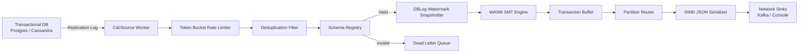

# Caminus CDC Engine - Staff-Level Architecture Specification

Caminus is a high-performance, distributed Change Data Capture (CDC) engine written in Rust. It bypasses JVM overhead to stream database mutations with sub-millisecond latency.

---

## High-Level Pipeline Architecture

---

## Core System Modules

### 1. Active-Standby Raft Consensus & HA Failover (`src/consensus/`)
*   Uses a self-contained, pure-Rust election engine without external Protobuf dependencies.
*   Enforces active leader leases: Standby nodes idle until leader heartbeats lapse, whereupon the failover controller promotes the node to active lease and resumes streaming from the exact offset stored in RocksDB `StateStore`.

### 2. Lock-Free DBLog Watermark Snapshotting (`src/snapshot/watermark.rs`)
*   Implements Netflix's DBLog algorithm.
*   Interleaves historical chunk SELECT queries with live replication log streams using low and high watermark markers, reconciling concurrent mutations without locking tables.

### 3. WASM Single Message Transforms (`src/transform/`)
*   Embeds `wasmtime` JIT/AOT engine to execute user-defined WebAssembly transformations at native memory speeds.

### 4. Dynamic Schema Evolution & DLQ (`src/storage/schema.rs`, `src/resiliency/dlq.rs`)
*   Tracks table schema versions in RocksDB and enforces `BACKWARD`, `FORWARD`, or `FULL` compatibility rules.
*   Poison pills or invalid schema events are safely isolated to the `DeadLetterQueue` with error headers (`failed_step`, `error_reason`, `retry_attempts`).

### 5. Multi-Tenant Router & Adaptive Backpressure (`src/router/`, `src/resiliency/rate_limiter.rs`)
*   Partitions events using `KeyHash` or `TenantPrefix` strategies.
*   Throttles ingestion rate via an async `TokenBucketLimiter` to prevent memory OOM during downstream sink outages.
